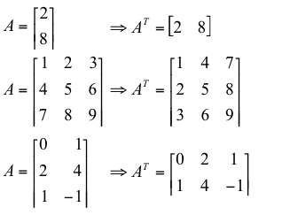
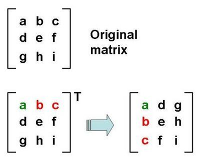

# Week 7
------

## Transpose
We start with some maths! A matrix is a list of lists, often represented as:


So we have rows, e.g ```[a,b]```, and columns, e.g ```[b,d]```. So we represent matrices in Haskell like so:
```haskell
  [[a,b,c],[d,e,f]]
```
So a list of lists: ```[[a]]```!

There is also a special type of matices: Square Matrices. This is when there are equal number of rows and columns. So the above Haskell example was square.

Finally, there is a process we can do to matrices: the transpose. This 'flips' the matrix along the diagonal. For example:



## Problem
We challenge you to write a function that will transpose a square matrix:
```haskell
  tranpose :: [[a]] -> [[a]]
```
This is quite a task, so don't just rush into writing the function immediately. Think about the components of the problem and how they come together, otherwise you will get stuck very quickly. Also, don't think about the problem in Haskell but rather generally - don't feel afraid to draw examples and equations in the whiteboard!

HINT:



## Extension
Can you change your transpose function to deal with any matrix, not only square matrices. There is one method that is quite easy and simple, but you may also need to rewrite your entire function if you completed transpose in a unique way.

## Solution
Here is a solution for the challenge:
```haskell
  transpose :: [[a]] -> [[a]]
  transpose m = reverse (helpRecursion m (length(m!!0) - 1))
  
  helpRecursion :: [[a]] -> Int -> [[a]]
  helpRecursion m i = case i of
    0 -> [rowHelp m 0]
    _ -> (rowHelp m i) : (helpRecursion m (i-1))
  
  rowHelp :: [[a]] -> Int -> [a]
  rowHelp ls i = case ls of
    [] -> []
    r:rs -> (r!!i) : (rowHelp rs i)
```
